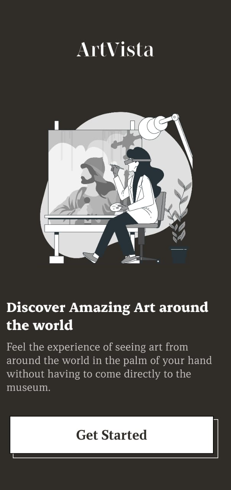
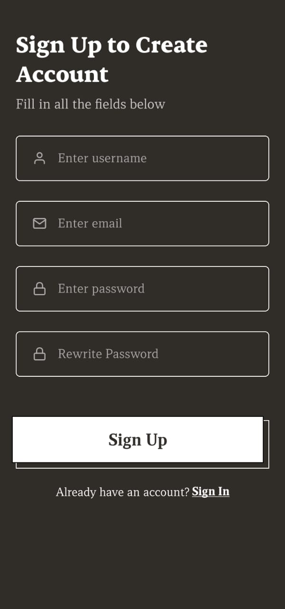
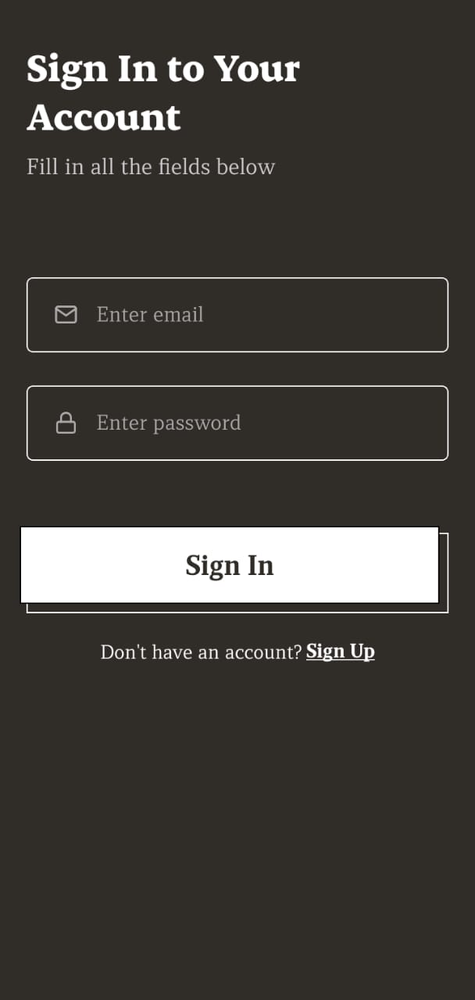
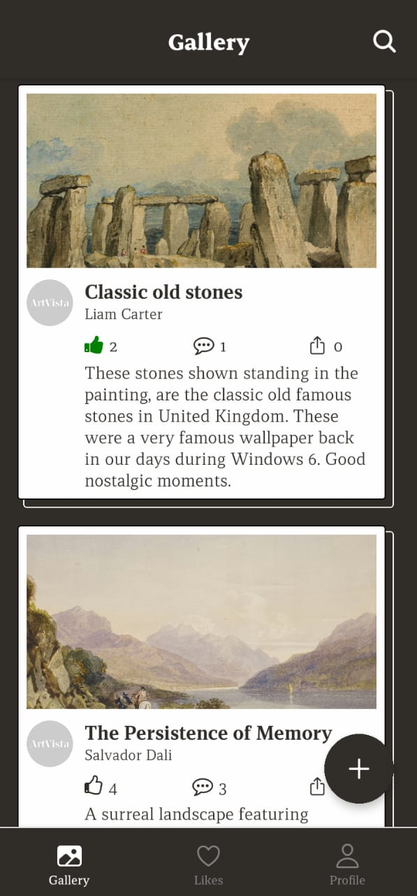
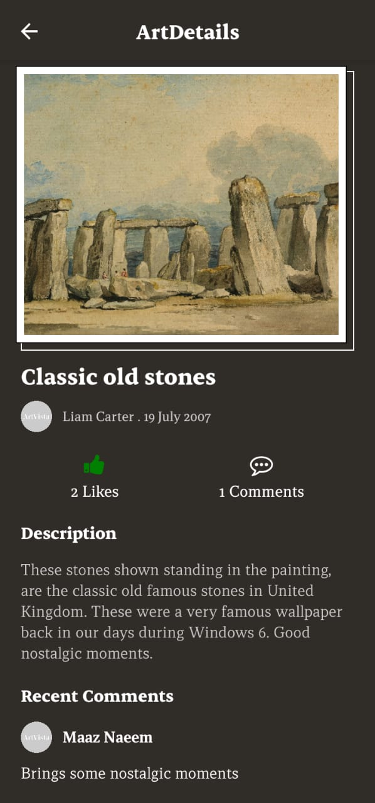
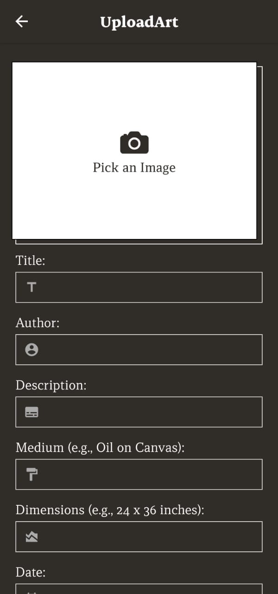
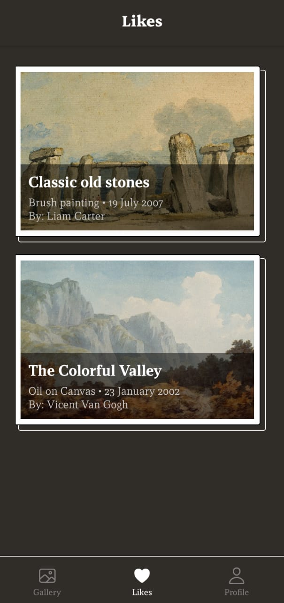
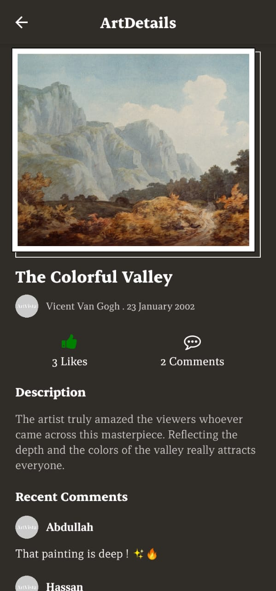
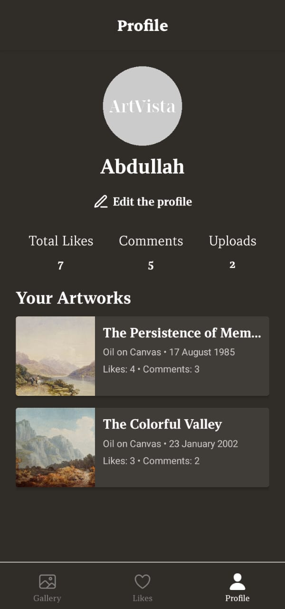

# ArtVista

ArtVista is a **React Native** app built with **TypeScript** and **Expo**, allowing users to upload and showcase their artwork. Users can interact with art by **liking** and **commenting**, view their **liked artworks**, and manage their profiles.

## Features

- Upload artwork from the phone's gallery
- View and interact with others' artwork (like & comment)
- See all liked artworks on a separate screen
- Profile screen displaying user details, uploaded artworks, total likes, and comments received

## Tech Stack

- **React Native Expo** – For building the mobile app
- **Firebase** (Authentication, Firestore, Storage) – For user management and storing data
- **React Navigation** – For handling screen navigation
- **Async Storage** – For local data persistence
- **Expo Image Picker** – For selecting images from the gallery
- **Expo Linear Gradient** – For UI enhancements

## Screenshots

Below are the screenshots of the ArtVista App.

<div style="flex-direction: row; gap: 10px;">
  
  
  
  
  
  
  
  
  
  
</div>

## Installation

1. Clone the repository:
   ```sh
   git clone https://github.com/yourusername/artvista.git
   ```
2. Navigate to the project directory:
   ```sh
   cd artvista
   ```
3. Install dependencies:
   ```sh
   npm install
   ```
4. Start the Expo development server:
   ```sh
   expo start
   ```

## Acknowledgements

This project was developed as a solo effort. Special thanks to the creators and maintainers of **React Native**, **Expo**, **Firebase**, and other open-source libraries that made this project possible. Their continuous efforts in improving the developer ecosystem have been invaluable.